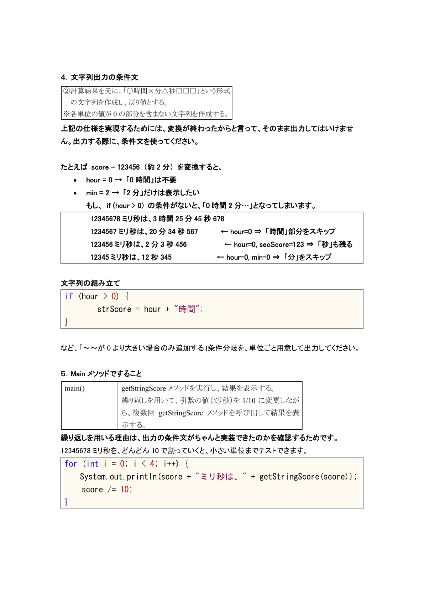
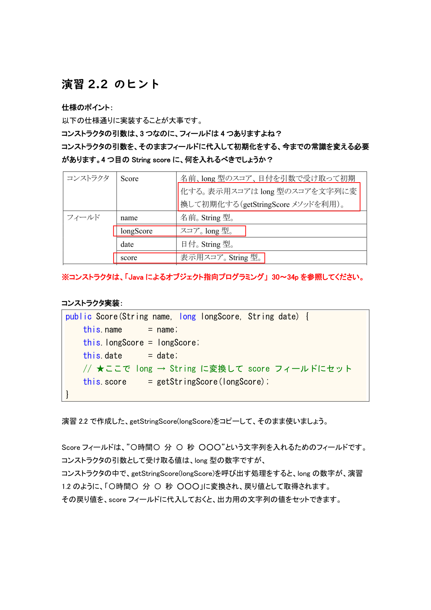
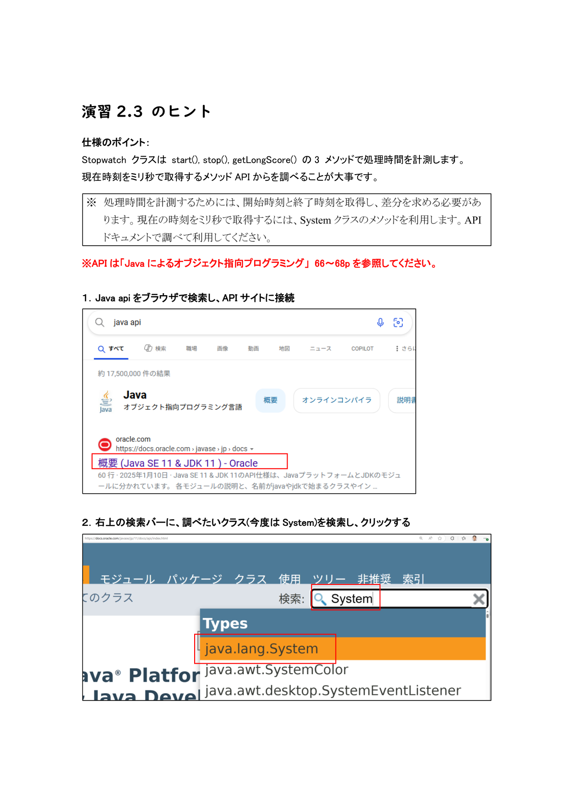
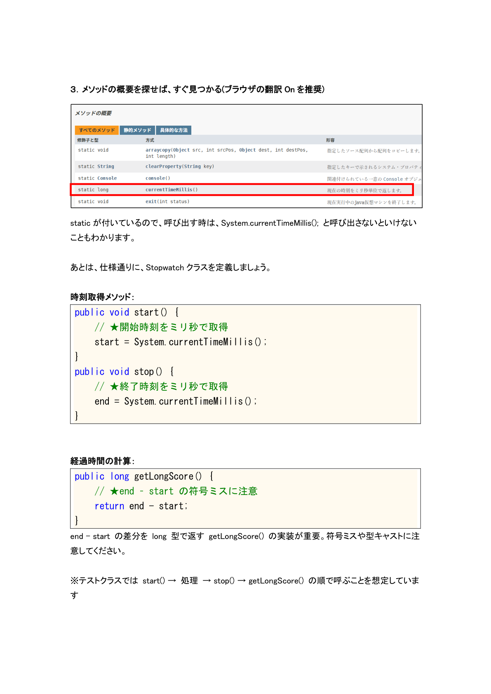

# EIMS個人演習のヒント（総合版）

## 演習1.1 のヒント

### 仕様確認

「5つの問題を格納する配列を作成し…」という部分を仕様書で再度確認してください。

※テキストの154～159行を参照してください。

### 配列の宣言・初期化

```java
String[] keywords = { "class", "int", "boolean", "if", "while" };
```

この記述方法が分かりにくい場合は、`String[]`（型）と変数名、`{}` 内に要素をカンマで区切って並べるルールを理解してください。

### 要素数の取得

`keywords.length` と記述する際につまずきやすいです。`length()` メソッドではなくプロパティである点に留意してください。

### 拡張 for 文

```java
for (String word : keywords) {
    System.out.println(word);
}
```

構文は「型 変数名 : 配列名」の順序で書きます。ループごとに配列の先頭から順に要素が取り出される仕組みをイメージすると理解しやすいです。

## 演習1.2 のヒント

### 仕様確認

「ミリ秒のスコアを…『○時間×分△秒□□□』という形式の文字列に変換」とあることを再確認してください。

※「アルゴリズム演習」 演習1.3 の問題と似ています。

### 1. `getStringScore` で変換しないといけない理由

ミリ秒（ms）だけの大きな数値をそのまま表示しても、何時間何分何秒なのかイメージしづらいですよね。

そこで「時間」「分」「秒」「ミリ秒」の4つの単位に分解し、読みやすい文字列に変換するのが目的です。

### 2. 「余り」と「商」を分ける理由

プログラムでは「余りを取ると小さい単位が得られ、商を取ると大きい単位に切り替わる」という法則を使います。

- 余り（`%`）: 小さい単位だけを取り出す
- 商（`/`）: 大きい単位にまとめる

このルールに従い、段階的に計算します。

### 3. 各変数の役割と“なぜここに代入するのか”

```java
long msec = score % 1000;       // ①：1000で割った余り → “ミリ秒だけ”を取り出す
long secScore = score / 1000;   // ②：ミリ秒分を除外した秒の値を取っておく
long sec = secScore % 60;       // ③：60で割った余り → “1分未満の秒”を取り出す
long minScore = secScore / 60;  // ④：全体を分に変換 → “秒”という単位をまとめる
long min = minScore % 60;       // ⑤：60で割った余り → “1時間未満の分”を取り出す
long hour = minScore / 60;      // ⑥：残った商 → “時間”を取得

// 以降、hour/min/sec/msec を組み合わせて文字列を作る
```

①で `msec` に入れておく理由:

- `score % 1000` を直接次の行で使うと式が長く、何をしているか分かりづらい。
- 一時変数 `msec` に名前を付けることで「これはミリ秒部分ですよ」と明示できる。

②で `secScore` に入れておく理由:

- 以降の「秒→分」「分→時間」の計算に何度も使うため、一度まとめておく。
- もし `score / 1000` を毎回書いたらミスや読み間違いの原因になります。

③～⑥の流れ:

- `secScore % 60`: 1分未満の「残り秒」を得る
- `secScore / 60`: 全体の「何分か」を得て、さらにそれを60で割り分ける
- それぞれ別の変数に代入することで、「ここでは秒を、次では分を…」と段階を追って確認できる

`12345678` ミリ秒は、3時間25分45秒678です。

| 変数名 | 計算式 | 値 | 解説 |
| --- | --- | ---: | --- |
| `msec` | `score % 1000` | 678 | 1000で割った余り → 「ミリ秒部分」だけ取り出す |
| `secScore` | `score / 1000` | 12345 | 3時間25分45秒分を、秒の単位で取っておく |
| `sec` | `secScore % 60` | 45 | 60で割った余り → 「1分未満の秒」だけ取り出す |
| `minScore` | `secScore / 60` | 205 | 残った3時間25分を、分単位で取っておく |
| `min` | `minScore % 60` | 25 | 60で割った余り → 「1時間未満の分」だけ取り出す |
| `hour` | `minScore / 60` | 3 | 残った3時間を、時間単位で取っておく |

### 4. 文字列出力の条件文

上記の仕様を実現するためには、変換が終わったからと言って、そのまま出力してはいけません。出力する際に、条件文を使ってください。

たとえば `score = 123456`（約2分）を変換すると、次のようになります。

- `hour = 0` → 「0時間」は不要
- `min = 2` → 「2分」だけは表示したい

もし、`if (hour > 0)` の条件がないと、「0時間2分…」となってしまいます。

```text
12345678 ミリ秒は、3時間25分45秒678
1234567 ミリ秒は、20分34秒567      ← hour=0 ⇒ 「時間」部分をスキップ
123456 ミリ秒は、2分3秒456          ← hour=0, secScore=123 ⇒ 「秒」も残る
12345 ミリ秒は、12秒345             ← hour=0, min=0 ⇒ 「分」をスキップ
```



### 文字列の組み立て

```java
if (hour > 0) {
    strScore = hour + "時間";
}
```

など、「～～が0より大きい場合のみ追加する」条件分岐を、単位ごと用意して出力してください。

### 5. Main メソッドですること

繰り返しを用いる理由は、出力の条件文がちゃんと実装できたのかを確認するためです。

`12345678` ミリ秒を、どんどん10で割っていくと、小さい単位までテストできます。

```java
for (int i = 0; i < 4; i++) {
    System.out.println(score + "ミリ秒は、" + getStringScore(score));
    score /= 10;
}
```


## 演習2.1 のヒント

### 仕様のポイント

配列の各要素と比較対象文字列が等しいかチェックするロジックを実装します。

※テキストの105～107行を参照してください。

### 文字列比較の注意点

`==` ではなく `equals()` メソッドで中身を比較しないと、常に「等しくない」と判定されてしまいます。

```java
for (String word : keywords) {
    System.out.print(input + " と " + word + " は、");
    // ★ここがポイント：'==' ではなく equals() で中身を比較
    if (input.equals(word)) {
        System.out.println("等しいです");
    } else {
        System.out.println("等しくないです");
    }
}
```

※ `String[] keywords = { "class", "int", "boolean", "if", "while" };` と `String input = "boolean";` は事前に宣言します。

### 出力例との比較

配列の長さを `array.length` で取得し、実行例の「5個の問題があります」という表示と比較結果のフォーマット（`boolean と class は等しくないです` など）が合っているか確認してください。

## 演習2.2 のヒント

### 仕様のポイント

以下の仕様通りに実装することが大事です。

コンストラクタの引数は3つなのに、フィールドは4つありますよね。

コンストラクタの引数を、そのままフィールドに代入して初期化する、今までの常識を変える必要があります。4つ目の `String score` に、何を入れるべきでしょうか。

※テキストの38～41行を参照してください。



### コンストラクタ実装

```java
public Score(String name, long longScore, String date) {
    this.name      = name;
    this.longScore = longScore;
    this.date      = date;
    // ★ここで long → String に変換して score フィールドにセット
    this.score     = getStringScore(longScore);
}
```

演習1.2で作成した、`getStringScore(longScore)` をコピーして、そのまま使いましょう。

`score` フィールドは、`〇時間〇分〇秒〇〇〇` という文字列を入れるためのフィールドです。コンストラクタの引数として受け取る値は `long` 型の数字ですが、コンストラクタの中で `getStringScore(longScore)` を呼び出す処理をすると、`long` の数字が演習1.2のように変換され、戻り値として取得されます。

その戻り値を `score` フィールドに代入しておくと、出力用の文字列の値をセットできます。

### getter メソッド

`getName()`, `getLongScore()`, `getDate()`, `getScore()` は戻り値の型とフィールドを対応させて正しく返すこと。

戻り値を間違えるとテストクラス `Ex2_2` が期待する出力とずれます。

### `toString` の実装

※テキストの38～41行を参照してください。

実行例のように出力するために、一番簡単な方法が `toString` メソッドを再定義することです。

```text
世界太郎, 2分3秒456, 2020/01/01 12:34:56
```

```java
@Override
public String toString() {
    // ★カンマと空白の位置を実行例と同じに
    return name + ", " + score + ", " + date;
}
```

実行例の出力になるように、「`,`」と文字列を `+` でうまく設定しておけば、Main メソッドで `System.out.println(score);` をするだけで、実行例のような出力ができます。

## 演習2.3 のヒント

### 仕様のポイント

`Stopwatch` クラスは `start()`, `stop()`, `getLongScore()` の3メソッドで処理時間を計測します。

現在時刻をミリ秒で取得するメソッドをAPIから調べることが大事です。

※テキストの98～102行を参照してください。

### 1. Java API をブラウザで検索し、APIサイトに接続



### 2. 右上の検索バーに、調べたいクラス（今回は `System`）を検索し、クリックする


### 3. メソッドの概要を探せば、すぐ見つかる

ブラウザの翻訳Onを推奨します。



`static` が付いているので、呼び出す時は、`System.currentTimeMillis();` と呼び出さないといけないこともわかります。

あとは、仕様通りに、`Stopwatch` クラスを定義しましょう。

### 時刻取得メソッド

```java
public void start() {
    // ★開始時刻をミリ秒で取得
    start = System.currentTimeMillis();
}

public void stop() {
    // ★終了時刻をミリ秒で取得
    end = System.currentTimeMillis();
}
```

### 経過時間の計算

```java
public long getLongScore() {
    // ★end - start の符号ミスに注意
    return end - start;
}
```

`end - start` の差分を `long` 型で返す `getLongScore()` の実装が重要です。符号ミスや型キャストに注意してください。

※テストクラスでは `start()` → 処理 → `stop()` → `getLongScore()` の順で呼ぶことを想定しています。

### 動作確認のコツ

`Ex2_3` の `main` で「0～999を出力するのに何ミリ秒かかったか」を測定します。

1. `start` メソッドを実行
2. `for` 文で0～1000回繰り返し数字を出力
3. `end` メソッドを実行
4. `getLongScore()` を実行すれば、2でかかったミリ秒を取得できるので、出力します。

ループを止める場所や `stop()` を呼ぶタイミングを見落とさないようにして、出力例と同じフォーマットになっているか確かめてください。

## 演習3.1 のヒント

### 仕様のポイント

キーボードから文字を入力してもらい、`return` する `KB` クラスの `readLine()` メソッドを定義します。

`BufferedReader` + `InputStreamReader(System.in)` や、`Scanner` で標準入力を1行読んで返します。

※テキストの42～49行を参照してください。

例外処理をしないとエラーになるので、`try-catch` で例外処理をしてください。

### 入力受付ループの注意点

```java
while (true) {
    System.out.print("何か入力(exitで終了)> "); // 入力を促す文字列
    String input = KB.readLine();
    // ★"exit" と比較するときは equals() を使う
    if ("exit".equals(input)) {
        break;
    }
    System.out.println(input);
}
```

## 演習3.2 のヒント

### 仕様のポイント

事前に `keywords.txt` を Eclipse のプロジェクト内に格納してください。

※テキストの28～29行を参照してください。

`TypingFile.read(String filename)` はクラスメソッドとして定義し、引数で渡されたファイル名のテキストを1行ずつ `ArrayList<String>` に追加して返します。

`ArrayList` に格納する理由は、入力を複数してもらうので、複数のデータを格納する必要があるからです。

### `TypingFile.java` の要点抜粋

```java
public static ArrayList<String> read(String filename) {
    ArrayList<String> list = new ArrayList<>();
    // ★try-with-resources で自動クローズ
    try (BufferedReader br = new BufferedReader(new FileReader(filename))) {
        String line;

        // この部分に以下のコードを書きましょう。
        // 1. 1行ずつ読んで null までループする。
        // 2. 読んだ文字列は list.add(line) しておくコード
    }

    return list;
}
```

例外処理は `try-with-resources` と `e.printStackTrace()` を使い、必ずリソースを解放するようにします。

### 動作確認例（`Ex3_2` の `main` 内）

`keywords.txt` は、Eclipseプロジェクト内の一番上位に配置しないといけません。誤字に気を付けてください。

```java
ArrayList<String> data = TypingFile.read("keywords.txt");
for (String s : data) {
    System.out.println(s); // ★ファイルの各行が順に表示されるか確認
}
```

`static` クラスメソッドを呼び出すので、クラス名.メソッド名で呼び出します。

## 演習3.3 のヒント

### 仕様のポイント

`Typing` クラスの `main()` では、以下の順序で各クラスを組み合わせます。

### 1. 問題読み込み

```java
ArrayList<String> keywords = TypingFile.read("keywords.txt");
```

### 2. 名前入力

```java
System.out.print("名前を入力> ");
String name = KB.readLine();
```

### 3. 練習開始待ち

```java
System.out.print("何かキーを押してください（タイピング練習開始）> ");
KB.readLine(); // ★何でも良いので1行読み込む
```

### 4. 時間計測開始

```java
Stopwatch sw = new Stopwatch();
sw.start();
```

### 5. 問題ループ

```java
while (keywords.size() > 0) {
    // ★残り問題数表示
    System.out.println("あと " + questions.size() + "問");

    // ★先頭問題を表示
    System.out.print(questions.get(0) + "> ");
    String line = KB.readLine();

    if (line.equals(keywords.get(0))) { // ★正解判定
        // ★正解なら先頭削除
        questions.remove(0);

        // ★出題順をランダム化
        Collections.shuffle(keywords);
    } else {
        // ★不正解時のメッセージ
        System.out.println("もう 1 回!");
    }
}
```

実行例:

```text
...
...
あと 1問
byte> byte
終了！
世界太郎さんの結果：15秒948
```

### 6. 時間計測終了＆結果を `Score` に記録。結果表示

```java
sw.stop();
Score s = new Score(name, stopwatch.getLongScore(), "now");
System.out.println("終了！");

// ここに、結果を出力するコードを書いてください。
```

この問題の実行例では、時間まで出力しなくても良いので、コンストラクタの第3引数には、任意の文字列を入れておけばOKです。

## 演習4.1 のヒント

### 仕様のポイント

`root` ユーザで MySQL に接続し、データベースとアプリ用ユーザを作成します。

### 注意点

- `-p` オプション直後にパスワードが続く書式を守る
- SQL文は必ずセミコロン（`;`）で終了する
- エラーが出た際は、妥協せず正しくもう一回入力すること

## 演習4.2 のヒント

### 仕様のポイント

`typinguser` で接続し、`score` テーブルを自動採番付き主キーで作成します。

```sql
-- ① typinguser でログイン
mysql -utypinguser -ppassword

-- ② 使用 DB 指定
USE typingdb;

-- ③ テーブル作成
CREATE TABLE score (
    no INT AUTO_INCREMENT PRIMARY KEY,
    name VARCHAR(20),
    score INT,
    datetime DATETIME
);

-- ④ 構造確認
DESC score;
exit;
```

### 注意点

- `AUTO_INCREMENT` を指定しないと主キーは自動採番されない
- `VARCHAR(20)` の文字数制限を超えないよう注意

## 演習4.3 のヒント

### 仕様のポイント

`INSERT` → `SELECT` → `UPDATE` → `DELETE` と順に操作を行い、結果を確認します。

※「データベース入門」の2章を参照してください。

```sql
-- ① レコード追加（現在日時は NOW()）
INSERT INTO score(name, score, datetime)
VALUES('たろう', 123456, NOW());

-- ② 登録確認
SELECT * FROM score;

-- ③ ソート表示（スコア小→大）
SELECT name, score, datetime
  FROM score
 ORDER BY score;

-- ④ 名前の更新
UPDATE score
   SET name = '太郎'
 WHERE name = 'たろう';

-- ⑤ レコード削除
DELETE FROM score
 WHERE name = '太郎';

exit;
```

### 注意点

- `NOW()` は MySQL の現在日時関数
- `WHERE` 条件を誤ると大量削除・更新になるため慎重に指定
- `SELECT *` は簡易確認用。実務では必要なカラムのみ指定すると可読性向上

## 演習5.1 のヒント

### 仕様のポイント

- MySQL Connector を必ずビルドパスに登録しておくこと
- `ScoreDAO` クラスのフィールドに JDBC の接続情報を持たせる（`url`, `user`, `pass`）
- 問題文で提示している接続情報に誤字がないか、しっかり確認してください
- `connectTest()` は `DriverManager.getConnection(...)` で接続し、「接続しました。」を出力、必ず切断する（`try-with-resources`）

※テキストの35行を参照してください。

```java
public void connectTest() {
    // ★ここで DB に接続してからメッセージを出す
    try (Connection con = DriverManager.getConnection(url, user, pass)) {
        System.out.println("接続しました。");
    } catch (SQLException e) {
        e.printStackTrace(); // ★例外時は必ずスタックトレース
    }
}
```

動作確認の際は、`ScoreDAO` のインスタンスを生成し、`connectTest` メソッドを呼び出してください。

## 演習5.2 のヒント

### 仕様のポイント

- `select()` メソッドを追加し、`score` テーブルから `name`, `score`, `datetime` を取得、`Score` オブジェクトに詰めて `ArrayList<Score>` で返す。
- SQLは `"SELECT name, score, datetime FROM score ORDER BY score"`、`Statement` + `ResultSet` で処理、必ず接続を閉じること。

※テキストの142～146行を参照してください。

※追加で、演習ガイド5.1の解答のソースコードも参照してください。

```java
public ArrayList<Score> select() {
    String sql = "SELECT name, score, datetime FROM score ORDER BY score";
    ArrayList<Score> list = new ArrayList<>(); // ★リストのインスタンスを予め宣言（空っぽのリスト生成）

    try (Connection con = DriverManager.getConnection(url, user, pass);
         Statement stmt = con.createStatement();
         ResultSet rs = stmt.executeQuery(sql)) {
        while (rs.next()) {
            // ★ここで ResultSet から各列を取り出し
            String name = rs.getString("name");
            long sc = rs.getLong("score");
            String dt = rs.getString("datetime");

            // ★DB から取得したデータを Score インスタンスを生成して記録しておく
            Score s = new Score(name, sc, dt);
            list.add(s); // データを詰めてリストに一行ずつ格納
        }
    } catch (SQLException e) {
        e.printStackTrace();
    }

    return list; // ★複数の記録が入っているリストを、main メソッドへ return する
}
```

### 動作確認例（`Ex5_2` Main メソッド）

```java
ScoreDAO dao = new ScoreDAO();
for (Score s : dao.select()) {
    System.out.println(s);
}
```

```text
さぶろう, 1分40秒200, 2023-02-02 12:34:56
じろう, 2分30秒123, 2023-01-01 00:00:00
```

## 演習5.3 のヒント

### 仕様のポイント

`insert(Score score)` メソッドを追加し、`PreparedStatement` で `name` と `score` をバインド、`datetime` は `now()` で現在日時を自動設定します。

SQLは `"INSERT INTO score (name, score, datetime) VALUES (?, ?, now())"` です。

必ず接続を閉じ、例外時はトレース出力します。

```java
public void insert(Score score) {
    String sql = "INSERT INTO score (name, score, datetime) VALUES (?, ?, now())";

    try (Connection con = DriverManager.getConnection(url, user, pass);
         PreparedStatement ps = con.prepareStatement(sql)) {
        // ★ここでパラメータを設定
        ps.setString(1, score.getName());
        ps.setLong(2, score.getLongScore());
        ps.executeUpdate();
    } catch (SQLException e) {
        e.printStackTrace();
    }
}
```

### 動作確認例（`Ex5_3`）

```java
ScoreDAO dao = new ScoreDAO();
dao.insert(new Score("シロー", 12345678, "テスト"));
for (Score s : dao.select()) {
    System.out.println(s);
}
```

既存のランキングに「シロー, 3時間25分45秒678, …」が追加されます。

## 演習5.4 のヒント

### 仕様のポイント

今まで実装したパーツを、組み立てれば完成です。

1. 演習3.3のソースコードでタイピング測定をする
2. 演習5.3の `insert` メソッドを呼び出し、DBにタイピング結果を記録する
3. 演習5.2の `select` メソッドを呼び出し、`return` される `ArrayList` の記録データを、拡張for文で出力します

`Score` オブジェクト生成時の時間は、任意の文字列（`now` など）で大丈夫です。登録される時は、演習5.3で作った通りに、MySQL の `now()` 関数で現在の時間が登録されるからです。

登録後、`dao.select()` で取得した `ArrayList<Score>` をループ出力し、ヘッダ `*** ランキング ***` を付けます。

```java
// タイピング処理後…
stopwatch.stop();
Score score = new Score(name, stopwatch.getLongScore(), "now");

// ★DB 登録
ScoreDAO dao = new ScoreDAO();
dao.insert(score);

// ★ランキング表示
System.out.println("*** ランキング ***");
for (Score s : dao.select()) {
    System.out.println(s);
}
```

実行例:

```text
終了！
世界太郎さんの結果：17秒11
*** ランキング ***
世界太郎, 17秒11, 2023-03-02 15:25:50
さぶろう, 1分40秒200, 2023-02-02 12:34:56
```

上記ポイントをヒントに、「これまで作成した `KB`, `TypingFile`, `Stopwatch`, `Score` クラス」と組み合わせて実装を進めてください。

特に、DB接続 → 登録 → 検索 → 表示の流れを一連で通す位置と、例外処理・リソース解放の確実性に注意すると全体がスムーズに動作します。
